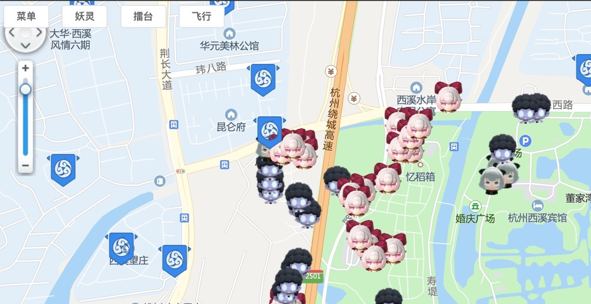

# 捉妖雷达 & 虚拟定位

## 介绍

一起来捉妖网页版雷达&定位功能
    
  - 支持妖灵展示、擂台展示
  - 目前仅支持iOS虚拟定位，需配合mac使用
  

  
## 功能

- 菜单：可筛选过滤，进行简单的设置
- 妖灵：点击后可以展示目标点附近的妖灵
- 擂台：点击后可以展示目标点附近的擂台
- 飞行：支持手机虚拟定位到目标点

## 原理

1、通过微信小程序捉妖雷达的接口将信息展示在地图上

2、手机虚拟定位
  - iOS：将目标位置生成gpx文件，然后使用Node服务器触发AppleScript，修改iPhone定位。
  - android：可以基于adb来实现，欢迎同学复写iOS_gps.js来实现

## 部署

iOS
  - 使用Xcode建一个空的项目，并能使用Xcode的Simulation进行虚拟定位，并且建立一个Location.gpx的文件，将该文件导入Xcode作为虚拟定位文件。将文件路径保存到iOS_gps.js文件内的变量gpx_file_position
  - 使用osacomplie指令对apple_script文件夹内的脚本进行编译，并产出可执行脚本。将文件路径保存到iOS_gps.js文件内的变量apple_script_position
  - 进入项目目录，执行指令 npm install && npm start
  - 使用浏览器访问 http://localhost:8080/

## 感谢

地图雷达：https://github.com/liuzirui1122/zhuoyao_radar/

ios虚拟定位：https://github.com/chanteP/ios-simulate-location-service